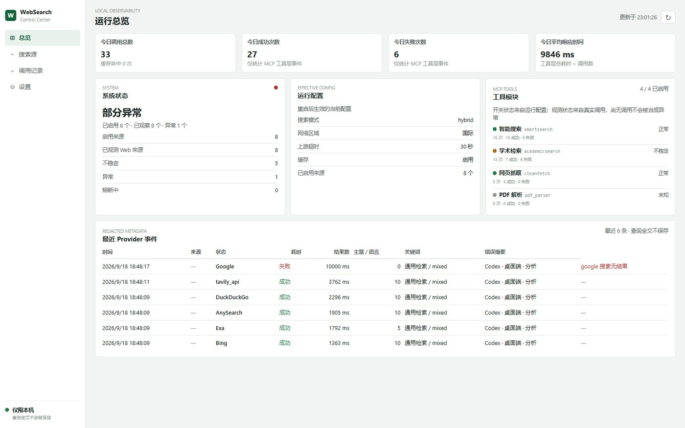

# websearch-mcpserver · matt 分支

> 本仓库是 [daidaiJ/websearch-mcpserver](https://github.com/daidaiJ/websearch-mcpserver) 的**扩展分支**，遵循上游 MIT 许可。
> 上游项目提供四个 MCP 搜索工具与搜索引擎管线；本分支在**不改动这些行为**的前提下，加了一层本机可观测性模块，用来回答“哪个来源、在什么时候、因为什么失败”。

- 本分支（对外主页）：<https://github.com/MattLYT/websearch-mcpserver-dashboard>
- 功能介绍页：<https://mattlyt.github.io/websearch-mcpserver-dashboard/>
- 上游项目（原作者维护）：<https://github.com/daidaiJ/websearch-mcpserver>

---

## 一、与主项目的区别

| 方面 | 主项目 | 本分支 |
|------|--------|--------|
| 四个 MCP 工具 | `smartsearch`、`academicsearch`、`cleanfetch`、`pdf_parser` | **完全一致**：参数、返回与调用路径未改动 |
| 搜索引擎与回退链 | 完整的 hybrid / apipool / 单引擎模式 | **完全一致**：选择、重试与合并逻辑未改动 |
| 本机控制台 | 无 | **新增**：`/dashboard/` 只读界面（总览 / 搜索源 / 调用记录 / 设置） |
| 调用遥测 | 无 | **新增**：工具层与来源层分别记录，SQLite 持久化，默认关闭 |
| 失败原因 | 只有错误文本 | **新增**：归类为限流 / 验证码 / 访问被拒 / 超时 / 网络 / 解析 / 无结果 |
| 来源健康判定 | 无 | **新增**：最近 20 次窗口 + 最小样本置信度，样本不足不误报 |
| 熔断状态 | 无 | **新增**：连续 3 次失败进入暂停，按错误类型定时长，成功即恢复；**只显示不干预调用** |
| 请求级关联 | 无 | **新增**：一次工具调用与其触发的来源事件共享 request id，可在页面展开调用链 |
| 机器可读出口 | 无 | **新增**：`GET /__admin/api/providers`、`GET /__admin/api/metrics`（Prometheus 文本） |
| 部署与发布 | 二进制 / GHCR 镜像 / MCP Registry | 沿用上游方式；控制台只是可选开关 |
| 仓库内 `ops/` 与部署笔记 | 无 | **本机运维脚本**，非产品功能：Windows 下 Docker 服务的计划任务自动恢复、维护开关与恢复测试；不需要自动恢复的部署可以完全忽略该目录 |

> 控制中心默认 **关闭**（`dashboard.enabled: false`），不开启时行为与上游一致。

---

## 二、安装教程

### 方式一：二进制（推荐）

```bash
# 1. 从上游 Release 下载对应平台二进制
#    https://github.com/daidaiJ/websearch-mcpserver/releases
# 2. 启动（无需手写配置，无需 API Key）
./websearch-mcpserver.exe install     # 首次运行生成预设 config.yaml 与 autostart.vbs
./websearch-mcpserver start
# 3. 在 MCP 客户端注册 http://localhost:8338/mcp（见 docs/installation.md）
```

> 「零配置」指首次启动会自动生成与 `config.example.yaml` 相同的预设 `config.yaml`；改端口、Key、模式都改这一份文件。默认只监听 `127.0.0.1`，开放网卡（`host: 0.0.0.0`）时建议配置 `auth_token` 保护业务端点。

### 方式二：Docker / Compose

```bash
docker pull ghcr.io/daidaij/websearch-mcpserver:latest   # 官方镜像（linux/amd64 + linux/arm64）
# 或自行构建：docker build -f Dockerfile.codex -t websearch-mcpserver:local .
```

```yaml
services:
  websearch:
    image: ghcr.io/daidaij/websearch-mcpserver:latest
    container_name: websearch-mcpserver
    restart: unless-stopped
    ports: ["127.0.0.1:8338:8338"]          # 仅本机可访问
    environment:
      - TAVILY_SK                            # 按需，未配置则自动降级
      - EXA_API_KEY
      - JINA_API_KEY
    volumes:
      - websearch-data:/data
      - ./config.yaml:/app/config.yaml:rw    # 用 :rw，控制台设置页才能保存
volumes:
  websearch-data:
```

### 启用控制台

在 `config.yaml` 追加（其余配置保持原样）：

```yaml
dashboard:
  enabled: true
  storage_path: ./data/dashboard.db
  retention_days: 30                          # 明细保留天数，每日汇总长期保留
  secrets_path: ./data/dashboard-secrets.json # 私密覆盖文件，接口不返回原值
  suspension:                                 # 只影响“显示为暂停”的时长，不影响调用
    ban_time_on_fail: 5s
    max_ban_time_on_fail: 24h
    suspended_times:
      rate_limit: 3m
      captcha: 1h
      access_denied: 24h
```

重启后访问 `http://127.0.0.1:8338/dashboard/`。

---

## 三、必要讲解

### 四个 MCP 工具

| 工具 | 用途 |
|------|------|
| `smartsearch` | 通用联网检索，支持时间范围与 `fetch_top_n` 正文抓取（1-5 条） |
| `academicsearch` | 多学术库并行检索（Crossref / OpenAlex / PubMed / Europe PMC / DBLP / DOAJ / arXiv / Semantic Scholar / Google Scholar） |
| `cleanfetch` | 抓取网页正文转 Markdown，支持最多 5 个 URL 批量 |
| `pdf_parser` | 解析本地或远程 PDF，可指定页码，必要时回退 MinerU |

### 搜索模式

| 模式 | 说明 | 需要 Key |
|------|------|----------|
| `engine` | 百度网页搜索 + Bing（代理可用时加入 DuckDuckGo） | **无需** |
| `baidu` | 百度千帆搜索，失败回退百度网页搜索 | 可选 |
| `apipool` | API Key 池轮转：每次只调一个供应商，失败自动切换，支持 round-robin / priority / weighted | 各 Key 可选 |
| `tavily` | Tavily Search API（[获取 Key](https://app.tavily.com/home)） | `TAVILY_SK` |
| `exa` | Exa Web Search API（[获取 Key](https://dashboard.exa.ai/api-keys)） | `EXA_API_KEY` |
| `anysearch` | AnySearch API（[获取 Key](https://www.anysearch.com/console/api-keys)） | `ANYSEARCH_API_KEY` |
| `doubao` | 豆包联网搜索 Global / Custom（[获取 Key](https://console.volcengine.com/search-infinity/api-key)） | `DOUBAO_SEARCH_API_KEY` |
| `hybrid` | 全引擎混合（Anysearch + 百度 + Tavily + Exa + 豆包 + Bing + DuckDuckGo 等） | 各 Key 可选 |

> 无 Key 时自动降级为 `engine` 模式；各模式细节见上游 [docs/search.md](docs/search.md)。

### 凭据（环境变量）

| 能力 | 变量 |
|------|------|
| 百度千帆 | `BAIDU_SK` |
| Tavily / Exa / AnySearch | `TAVILY_SK` / `EXA_API_KEY` / `ANYSEARCH_API_KEY` |
| 豆包搜索 | `DOUBAO_SEARCH_API_KEY`（或 `ASK_ECHO_SEARCH_INFINITY_API_KEY`） |
| 学术增强 | `SEMANTIC_SCHOLAR_API_KEY`、`UNPAYWALL_EMAIL` |
| 正文抓取 / PDF | `JINA_API_KEY`、`MINERU_TOKEN` |
| LLM 摘要 | `LLM_BASE_URL`、`LLM_API_KEY`、`LLM_MODEL_ID` |

未配置的凭据会被自动跳过，不影响其他来源。其他通用能力（SQLite 缓存、相关性评分与 MMR 去重、LLM 摘要）与主项目一致。

---

## 四、本分支新增：本机控制中心

打开 `http://127.0.0.1:8338/dashboard/` 可以看到四个页面：



| 页面 | 能看到什么 |
|------|------------|
| **总览** | KPI（调用数 / 成功 / 失败 / 平均耗时）、系统状态（含熔断中数量）、运行配置、四个工具模块的观测状态 |
| **搜索源** | 每个来源的健康、最近 20 次结果、失败构成（如 `解析失败 ×4`）、成功率、平均 / P95 延迟、额度、最近错误与熔断倒计时 |
| **调用记录** | 工具与来源分列；可按层级 / 状态 / 工具 / 来源 / 错误类型筛选；工具行可点 request id 展开这次调用的来源链 |
| **设置** | 备份当前 YAML 后写入白名单配置（模式、超时、阈值、熔断时长等），密钥永不回显 |

几点具体行为：

- **四个工具始终显示**：即使某个工具从未被调用，也显示为“可调用 · 尚无观测”，不会因历史为空而消失。
- **失败分类 + 置信度**：一次失败不会被当成来源损坏；样本少于 5 次标记“样本不足”，连续 3 次失败才进入熔断。
- **熔断只报告**：显示暂停原因与恢复时间，但不会跳过任何调用，搜索路径与上游一致。
- **请求级调用链**：一次工具调用与其触发的来源事件共享 request id，用来回答“这次结果是谁给的、谁失败了”。

机器可读出口（只读，不触发搜索）：

```bash
curl http://127.0.0.1:8338/__admin/api/providers   # 每个来源的状态机与失败构成
curl http://127.0.0.1:8338/__admin/api/metrics     # Prometheus 文本指标
```

### 数据与隐私

- 只保存脱敏元数据：查询以哈希 + 主题 + 语言 + 关键词落库，**完整查询与 URL 不写入数据库**。
- 密钥保存在独立的私密覆盖文件，页面与接口**永不回显原值**。
- 不发起主动探测；控制台与 MCP 端点共用 loopback 边界，默认只有本机能访问。

---

## 文档与致谢

上游文档（本分支保持不变）：[docs/installation.md](docs/installation.md) · [docs/configuration.md](docs/configuration.md) · [docs/search.md](docs/search.md) · [docs/architecture.md](docs/architecture.md) · [docs/api.md](docs/api.md)

本分支新增说明：`docs/zh/index.html`（中文介绍页）、`docs/en/index.html`（English）。

核心搜索能力、引擎适配、缓存与文档均来自 [daidaiJ/websearch-mcpserver](https://github.com/daidaiJ/websearch-mcpserver)，遵循其 **MIT 许可**；本分支只增加可观测性模块，项目本身的 Issue 与 PR 请提交给上游。